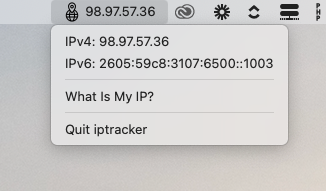

# IPTracker
IPTracker is a simple tool to track your external IP addresses and notify you when they change.

## Installation
1. Download the latest release from the [releases page](https://github.com/modernben/iptracker/releases)
2. Follow the install steps for your system

## Development
1. Clone the repository
2. composer install
3. php artisan native:serve
